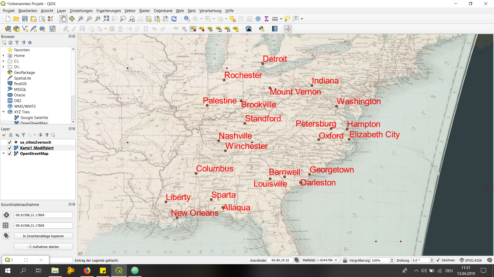
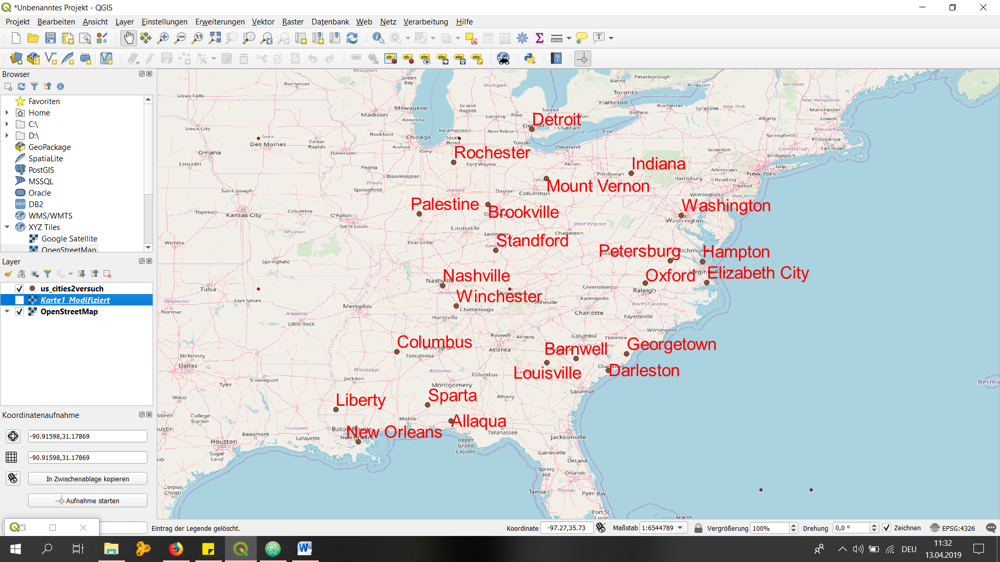
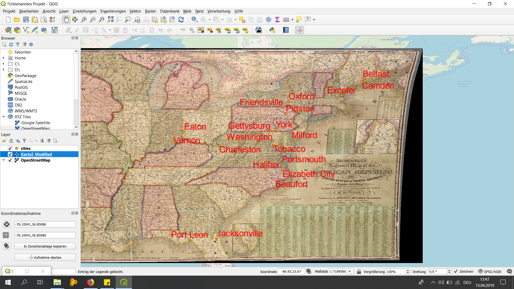
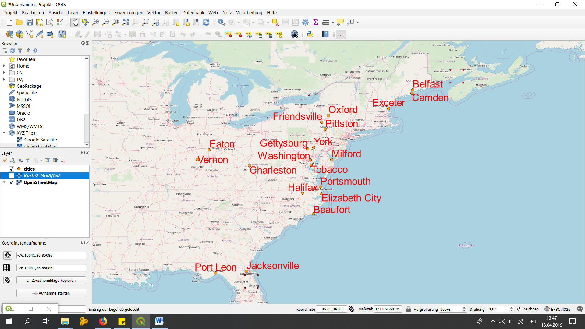

# Georeferencing:

## Map1:

city,state,lon,lat,lon1,lat1

New York,New York,-8234229.297,4970380.761,-8234229.297,4970380.761

Philadelphia,Pennsylvania,-8368867.370,4858182.367,-8368867.370,4858182.367

Washington,Washington,-77.15340,38.92569,-77.15340,38.92569

Oxford,,-78.59754,36.23578,-78.59754,36.23578

Petersburg,,-77.58981,37.11655,-77.58981,37.11655

Elizabeth City,,-76.13773,36.24371,-76.13773,36.24371

Nashville,,-86.65934,36.13262,-86.65934,36.13262

Winchester,,-86.11977,35.30740,-86.11977,35.30740

Columbus,,-88.48436,33.49032,-88.48436,33.49032

Palestine,,-87.59565,38.98123,-87.59565,38.98123

Mount Vernon,,-82.53322,40.39364,-82.53322,40.39364

Brookville,,-84.85813,39.35417,-84.85813,39.35417

Standford,,-84.53280,37.52916,-84.53280,37.52916

Detroit,,-83.10453,42.35354,-83.10453,42.35354

Rochester,,-86.21499,41.03636,-86.21499,41.03636

Indiana,,-79.15298,40.59201,-79.15298,40.59201

Hampton,,-76.32024,37.08481,-76.32024,37.08481

Louisville,,-82.50148,33.04597,-82.50148,33.04597

Allaqua,,-86.32608,30.73693,-86.32608,30.73693

Barnwell,,-81.35093,33.21260,-81.35093,33.21260

Georgetown,,-79.33548,33.40304,-79.33548,33.40304

Darleston,,-80.05755,32.75238,-80.05755,32.75238

New Orleans,,-90.02372,29.90377,-90.02372,29.90377

Sparta,,-87.24717,31.36524,-87.24717,31.36524

Liberty,,-90.91598,31.17869,-90.91598,31.17869

## Map2:

city,state,lon,lat,lon1,lat1

Washington,,-76.91258,38.95140,-76.91258,38.95140

Tobacco,,-76.85028,38.56274,-76.85028,38.56274

Milford,,-75.23631,38.98996,-75.23631,38.98996

Exceter,,-70.79419,42.98038,-70.79419,42.98038

Camden,,-68.98441,44.16416,-68.98441,44.16416

Belfast,,-68.92507,44.42227,-68.92507,44.42227

Oxford,,-75.50110,42.43448,-75.50110,42.43448

Friendsville,,-76.00547,41.91232,-76.00547,41.91232

Pittston,,-75.73548,41.35158,-75.73548,41.35158

Gettysburg,,-77.10320,39.82958,-77.10320,39.82958

York,,-76.63444,39.93639,-76.63444,39.93639

Vernon,,-85.69670,38.98700,-85.69670,38.98700

Eaton,,-84.75917,39.74948,-84.75917,39.74948

Charleston,,-81.63507,38.50637,-81.63507,38.50637

Jacksonville,,-81.87539,30.28225,-81.87539,30.28225

Port Leon,,-84.27261,30.16357,-84.27261,30.16357

Beaufort,,-76.65521,34.75923,-76.65521,34.75923

Elizabeth City,,-76.02624,36.33760,-76.02624,36.33760

Halifax,,-77.50373,36.37617,-77.50373,36.37617

Portsmouth,,-76.10041,36.85086,-76.10041,36.85086

# CodeAcademy - Learn Python Units 3 & 4:

