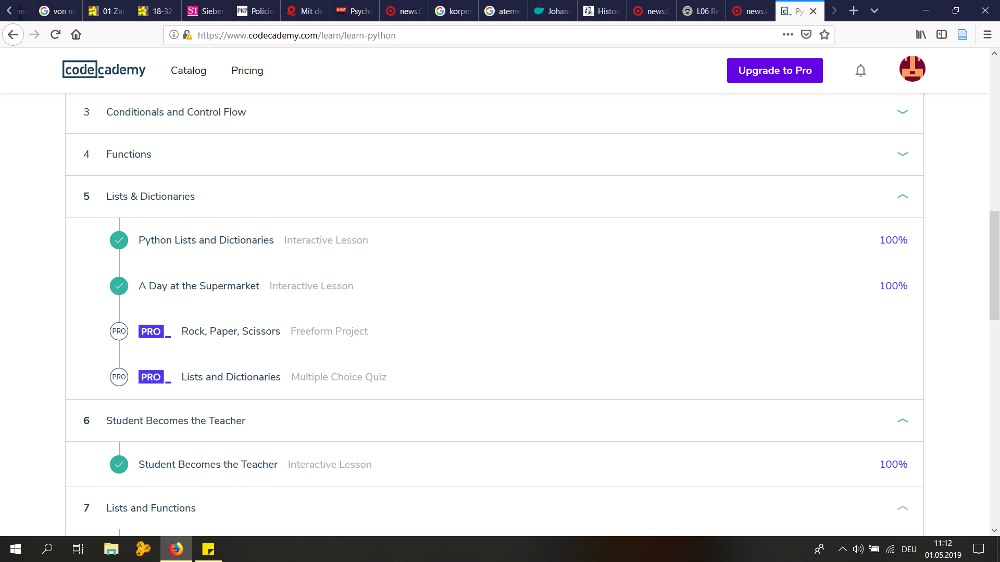

# Regex:

## PART I

1.

`\b((.|)eat|eat(s|e|i)|ate)[a-z]*`

2.

`M[a-z]*[e|a]r|G[a-z]*afi|aff?(i|y)`

3.

`\b[I|E|e|h].*(a|.)h.n`

## PART II

1.

`Search: ^\t\w+, \w+$`
`Replace: \2 \1`

2.

`Vienna|Graz|Linz|Salzburg|Innsbruck|Klagenfurt|Villach|Wels|Sankt Pölten|Dornbirn|Wiener Neustadt|Steyr|Feldkirch|Bregenz|Leonding|Klosterneuburg|Baden bei 
Wien|Wolfsberg|Leoben|Krems|Traun|Amstetten|Lustenau|Kapfenberg|Mödling|Hallein|Kufstein|Traiskirchen|Schwechat|Braunau am Inn|Stockerau|Saalfelden|Ansfeld
en|Tulln|Hohenems|Spittal an der Drau|Telfs|Ternitz|Perchtoldsdorf|Bludenz|Bad Ischl|Eisenstadt|Schwaz|Hall in Tirol|Gmunden|Wörgl|Wals-Siezenheim|Marchtre
nk|Bruck an der Mur|Sankt Veit an der Glan|Korneuburg|Neunkirchen|Hard|Vöcklabruck|Lienz|Rankweil|Hollabrunn|Enns|Brunn am Gebirge|Ried im Innkreis|Bad Vös
lau|Waidhofen|Knittelfeld|Trofaiach|Mistelbach|Zwettl|Völkermarkt|Götzis|Sankt Johann im Pongau|Gänserndorf|Gerasdorf bei Wien|Ebreichsdorf|Bischofshofen|G
roß-Enzersdorf|Seekirchen am Wallersee|Sankt Andrä`

3.

`\w+\b (\(Lower Austria\)|\(Salzburg\))`

# CodeAcademy - Learn Python Units 5 & 6:

