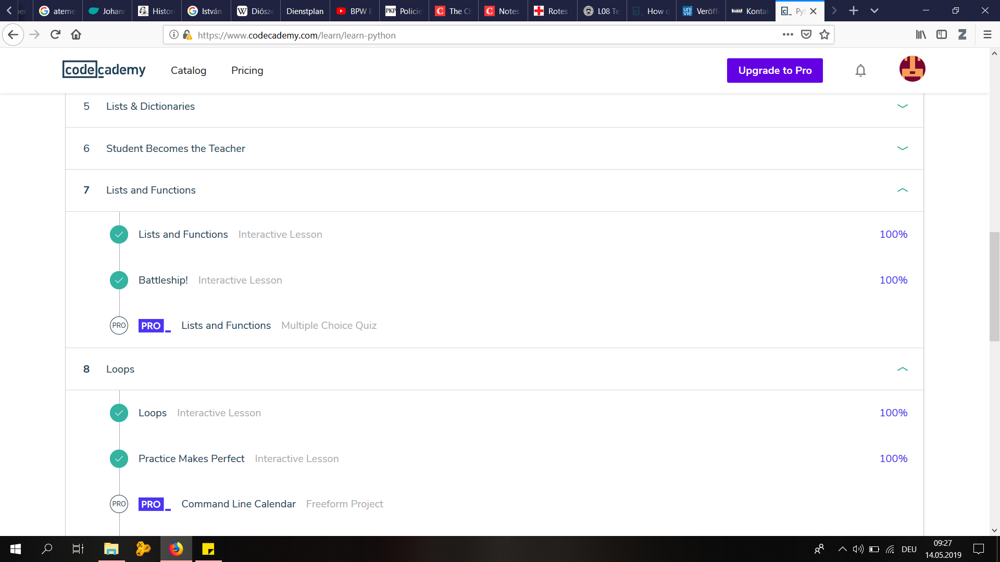

# Webscraping:

1.Checking the URL of one Document (e.g.: `http://www.perseus.tufts.edu/hopper/text?doc=Perseus%3atext%3a2006.05.0001`)

2.Checking the URL of the xml-file of the same document (e.g.:`www.perseus.tufts.edu/hopper/dltext?doc=Perseus%3Atext%3A2006.05.0001`)

3.Copy-Paste the "Seitenquellentext" (Code) of the Website to EditPad Pro

4.Collecting the URLs of the Documents with Regex 

5.Replacing the first part of the URL `(www.perseus.tufts.edu/hopper/text?doc=)` with `www.perseus.tufts.edu/hopper/dltext?doc=` using Regex

6.Using wget - i articles3_links.txt -P ./Articles/ -nc to get the files

# CodeAcademy - Learn Python Units 7 & 8:

