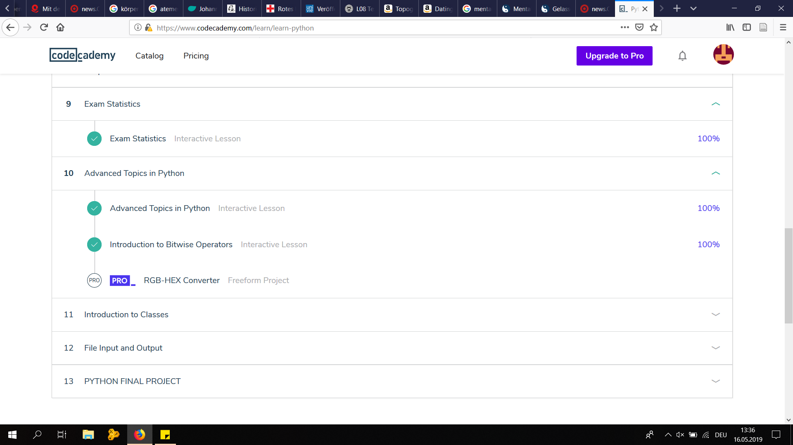

# Cleaning the "Dispatch":

## 1a:

import os
import re      #import regular expressions

original_path = "C:\\Users\\Tobias\\Desktop\\UNI\\_MA Geschichte\\Zweites Semester\\KU Digital Humanities\\wgetfolder\\Articles3\\"

listOfFiles = os.listdir(original_path) #getting all friles from the folder

new_path = "C:\\Users\\Tobias\\Desktop\\UNI\\_MA Geschichte\\Zweites Semester\\KU Digital Humanities\\_Aufgaben\\CleanCopiesText"

for f in listOfFiles: #looping through the files
    with open(original_path+f, "r", encoding="utf8") as f1:     #opening the files
        data = f1.read()
  
    data = re.sub("<[^<]+>", "", data)          #removing the xml/html-headers (<...>)
    
    newFileName = f + "_modified.xml"           #creating/saving the new files
    with open(new_path+newFileName, "w", encoding="utf8") as f9:
        f9.write(data)

## 1b:

import os
import re      #import regular expressions

original_path = "C:\\Users\\Tobias\\Desktop\\UNI\\_MA Geschichte\\Zweites Semester\\KU Digital Humanities\\wgetfolder\\Articles3\\"

listOfFiles = os.listdir(original_path) #getting all friles from the folder

new_path = "C:\\Users\\Tobias\\Desktop\\UNI\\_MA Geschichte\\Zweites Semester\\KU Digital Humanities\\_Aufgaben\\CleanCopiesText"

for f in listOfFiles: #looping through the files
    with open(original_path+f, "r", encoding="utf8") as f1:     #opening the files
        data = f1.read()
   
    data = re.sub("<[^<]+>", "", data)          #removing the xml/html-headers (<...>)

    newFileName = f + "_modified.xml"           #creating/saving the new files
    with open(new_path+newFileName, "w", encoding="utf8") as f9:
        f9.write(data)

# CodeAcademy - Learn Python Units 9 & 10:

