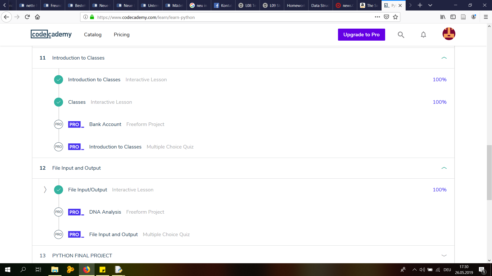

# Converting to json:

```
import re, os

source = "C:\\Users\\Tobias\\Desktop\\UNI\\_MA Geschichte\\Zweites Semester\\KU Digital Humanities\\wgetfolder\\Articles3\\"
target = r"C:\\Users\\Tobias\\Desktop\UNI\\_MA Geschichte\\Zweites Semester\\KU Digital Humanities\\_Aufgaben\\09_StructuringData\\"

list_of_files = os.listdir(source)
counter = 0

empty_list = [] #creating an empty list outside of the loop to afterwards append every new element to the list until the loop is done


for f in list_of_files:	#looping through the list of files
    if f.startswith("dltext"):
        with open(source + f, "r", encoding="utf8") as f1: #opening the files
            text = f1.read()

            date = re.search(r'<date value="([\d-]+)"', text).group(1) #finding the date

            split = re.split("<div3 ", text) #splitting into articles

            counter2 = 0
            
            for s in split[1:]: #looping through the issues
                counter2 += 1
                s = "div3 " + s

                try:
                    unitType = re.search(r'type="([^\"]+)"', s).group(1) #finding the type
                except:
                    unitType= "noType"
                    print(s)

                try:
                    header = re.search(r'<head>(.*)</head>', s).group(1) #finding the header, removing the html-tags
                    header = re.sub("<[^<]+>", "", header)
                except:
                    header = "NO HEADER"
                    print("\nNo header fount!\n")

                text = re.sub("<[^<]+>", "", s)		#removing html-tags
                text = re.sub(" +\n|\n +", "\n", text)
                text = re.sub("\n+", ";;; ", text)

                fName = date+"_"+unitType+"_"+str(counter2)	#creating file-name

                itemID = date+"_"+unitType+"_"+str(counter2)	#creating variables for date, type, header, text
                dateVar = date
                unitType = unitType
                header = header
                text = text

                var = {		#creating the variable to reformat into json
		"ID": itemID,
		"date": dateVar,
		"type": unitType,
		"header": header,
		"text": text
		}

                empty_list.append(var) #append the new elements to the list created at the beginning


        counter += 1
        if counter % 100 == 0:
            print(counter)

with open(target+".json", "w", encoding="utf8") as f9:	#saving in json-format 
	f9.write(str(empty_list))
```


# CodeAcademy - Learn Python Units 11 & 12:




