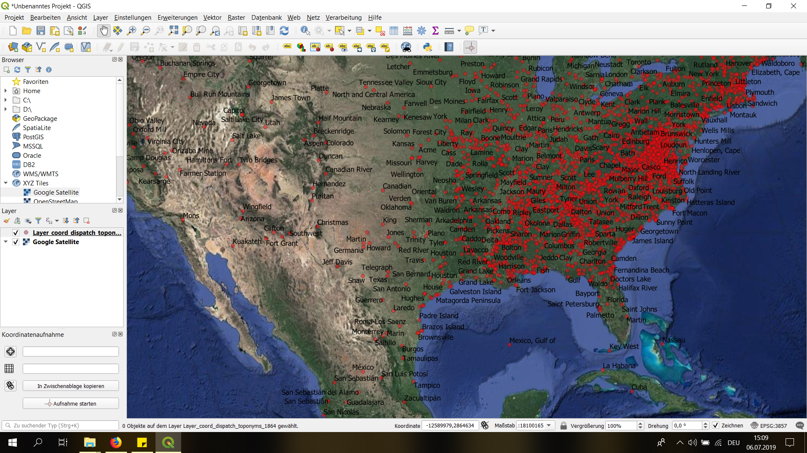
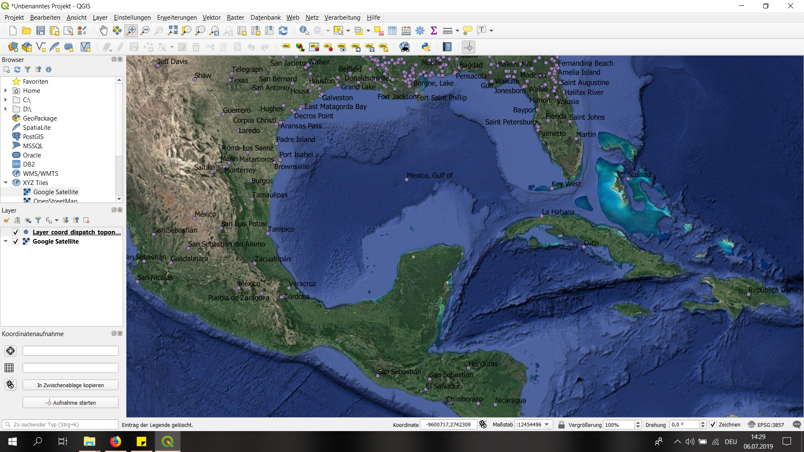
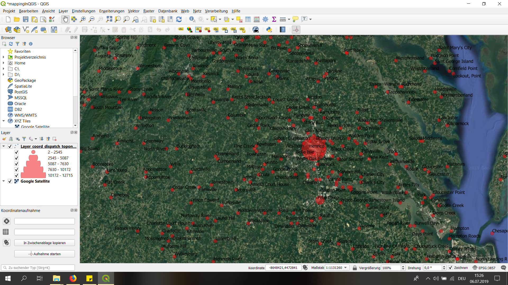

# Codes:

## Step1: Collecting the Toponyms

```
import re, os #importing regular expressions and the OS Module

source = "C:\\Users\\Tobias\\Desktop\\UNI\\_MA Geschichte\\Zweites Semester\\KU Digital Humanities\\wgetfolder\\Articles3\\"    #defining a variable for the path to the xml-files of the articles
target_folder = "C:\\Users\\Tobias\\Desktop\\UNI\\_MA Geschichte\\Zweites Semester\\KU Digital Humanities\\_Aufgaben\\10\\PlaceNames\\" #defining a variable for the path to where I want to save the new file

list_of_files = os.listdir(source)  #defining a variable for the path to the xml-files
counter = 0     #setting a counter

def generate(filter):   #defining a function "generate"; filter wil then be the years (1861-1865) -> goes through all xmls, looks for four digits(->year)

    topCountDictionary = {}     #creating an empty dictionary for the toponyms

    print(filter)   #printing the function
    counter = 0     #setting another counter
    for f in list_of_files:     #looping through the list of files
        if f.startswith("dltext"):  #checking the file-name
            with open (source + f, "r", encoding="utf8") as f1: #opening the files
                text = f1.read()    #setting a variable text

                text = text.replace("&amp;","&")    #replacing "&amp;" with "&" in the text-files

                date = re.search(r'<date value="([\d-]+)"', text).group(1) #searching for the date

                if date.startswith(filter):     #checking if the date we are using our function "generate" on corresponds with the filter
                    for tg in re.findall(r"(tgn,\d+)", text): #finding all the tgn-keys in the files
                        tgn = tg.split(",")[1]  #splitting the tgn-keys into "tgn" an the tgn-number/digit; using [1] to store the digit in our variable "tgn"

                        if tgn in topCountDictionary: #using an if-clause to count the frequencies
                            topCountDictionary[tgn] += 1    #1 added to the frequency if the TGN is already in the topCountDictionary
                        else:
                            topCountDictionary[tgn] = 1     #if the TGN is not already in the dictionary the frequency stays as it is
            
    top_TSV = []    #creating an empty list for the toponyms

    for key, value in topCountDictionary.items(): #in the topCountDictionary we are now:
        val = "%09d\t%s" % (value, key)     #defining a variable "val", when we print "val" it would print out the value including 10 digits, TAB, the key as string
        top_TSV.append(val)  #appending the "val"-variable to the empty list for the toponyms

    header = "freq\ttgn\n"  #defining a header to name the files we are going to create -> the name will be a string: the frequency, TAB, the tgn
    with open("dispatch_toponyms_%s.tsv" % filter, "w", encoding="utf8") as f9:  #saving the new files
              f9.write(header+"\n".join(top_TSV))

#using the function we defined on the years from 1861-1865:

generate("1861")
generate("1862")
generate("1863")
generate("1864")
generate("1865")
```

## Step2: Collecting the TGN-data

```
import re, os #importing regular expressions and the OS Module

source = "E:\\TGNs\\"   #defining a variable for the path to the TGN-files

def generateTGNdata(source): #defining a function that creates the TGN-data

    list_of_files = os.listdir(source) #creating a list of files from the TGN-xml-files

    tgnList = [] #empty list for the ID, Name and Coordinates of the TGNs
    tgnListNA = [] #empty list for ID, Name of TGNS that don't have coordinates
    count = 0 #setting the counter to zero

    for f in list_of_files:   #looping through the list_of_files
        if f.startswith("TGN"): #testing the filenames
            print(f)    #printing the names of the files
            with open(source+f, "r", encoding="utf8") as f1:    #opening the files
                data = f1.read()     #defining a variable "data", reading the files

                data = re.split("</Subject>", data) #splitting "<Subject>...</Subject>", storing "<Subject>...</Subject>" into a new variable
                
                for d in data:  #looping through data, respectively each "<Subject>...</Subject>"
                    d = re.sub("\n +", "", d)   #cleaning out newline-characters

                    if "Subject_ID" in d: #getting the Subject_ID of each "<Subject>...</Subject>" with regex and storing it in a new variable "placeID"
                        placeID = re.search(r"Subject_ID=\"(\d+)\"", d).group(1)

                        placeName = re.search(r"<Term_Text>([^<]+)</Term_Text>", d).group(1)    #getting the placname of each "<Subject>...</Subject>" with regex and storing it into a new variable "placeName"

                        if "<Coordinates>" in d:    #finding the coordinates: if coordinates are included in d/"<Subject>...</Subject>", then:

                            latGr = re.search(r"<Latitude>(.*)</Latitude>", d).group(1) #searching for the latitude with regex
                            decimal_lat = re.search(r"<Decimal>(.*)</Decimal>", latGr).group(1) #searching for the decimals, the minutes and the degrees with regex
                            minutes_lat = re.search(r"<Minutes>(.*)</Minutes>", latGr).group(1)
                            degrees_lat = re.search(r"<Degrees>(.*)</Degrees>", latGr).group(1)

                            try:    #using try/except if some minute or degree doesn't have a value in it (Gabriele Hackl helped me on this)
                                minutes_lat = float(minutes_lat)/60     #calculating: the coordinates are rounded, so we extract degrees and minutes (as above), then we convert: minutes/60 -> float(degrees) + float(converted minutes) -> then convert it back to a string! -> str(float(degrees) + float(minutes/60))
                                lat = float(degrees_lat)+minutes_lat
                                lat = str(lat)
                                if "-" in decimal_lat:  #checking if that latitude-direction is positive/east or negative/west
                                    lat = "-"+lat   #if it is negative, write a minus in front of "lat" so that our coordinate-variable is negative/goes to west as well
                            except ValueError:  #if we don't find a value in one of the tags we searched above, we store the string "NA" into our variable "lat"
                                lat = "NA"

                            lonGr = re.search(r"<Longitude>(.*)</Longitude>", d).group(1) #doing the same process as above for the longitude
                            decimal_lon = re.search(r"<Decimal>(.*)</Decimal>", lonGr).group(1)
                            minutes_lon = re.search(r"<Minutes>(.*)</Minutes>", lonGr).group(1)
                            degrees_lon = re.search(r"<Degrees>(.*)</Degrees>", lonGr).group(1)

                            try:
                                minutes_lon = float(minutes_lon)/60
                                lon = float(degrees_lon)+minutes_lon
                                lon = str(lon)
                                if "-" in decimal_lon:
                                    lon = "-"+lon
                            except ValueError:
                                lon = "NA"
                            
                           
                            

                        else:
                            lat = "NA"  #"NA" as lat & lon if there are no coordinates found for the TGN
                            lon = "NA"

                        tgnList.append("\t".join([placeID, placeName, lat, lon]))   #appending ID, placename and coordinates into the empty list we defined at the top of the file

                        if lat == "NA":
                            #print("\t"+ "; ".join([placeID, placeName, lat, lon])) #printing the TGNs without coordinates, I didn't do this when running the code to run it faster
                            tgnListNA.append("\t".join([placeID, placeName, lat, lon])) #appending ID and placename and NA instead of coordinates to the list for TGNs without coordinates
                            
    
    header = "tgnID\tplacename\tlat\tlon\n"     #defining a variable "header" to name the new files ()

    with open("tgn_data_light.tsv", "w", encoding="utf8") as f9a:   #creating a TSV-file with the TGN-data of the TGNs with coordinates
        f9a.write(header+"\n".join(tgnList))  

    with open("tgn_data_light_NA.tsv", "w", encoding="utf8") as f9b:    #creating a TSV-file with the TGN-data of the TGNs without coordinates
        f9b.write(header+"\n".join(tgnListNA))

    print("TGN has %d items" % len(tgnList))    #printing the number of items in "tgnList"

generateTGNdata(source) #calling the function we defined and using it on the TGN-files
```

## Step3: Matching

```
import re, os   #importing regular expressions and the OS Module

source = "C:\\Users\\Tobias\\Desktop\\UNI\\_MA Geschichte\\Zweites Semester\\KU Digital Humanities\\TGN_data\\tgn_data_light.tsv"   #defining a variable for the path to the tgn-file we want to use


def loadTGN(tgnTSV):    #defining a function to load the TGN-data into a dictionary (which is the data from "tgn_data_light.tsv" as we defined in "source")
    with open(tgnTSV, "r", encoding="utf8") as f1: #opening the file with the TGN-data
        data = f1.read().split("\n")    #splitting the file into new lines

        dic = {}    #creating an empty dictionary

        for d in data:  #looping through the TGN-data
            d = d.split("\t")   #splitting file with the TGN-data into tabs

            dic[d[0]] = d   #storing each tgn-entry in the dictionary we created above, starting with the first entry

    return(dic) #returning the dictionary

#start matching:

def match(freqFile, dicToMatch):  #defining a function that takes the frequency-file and our dictionary as arguments
    with open(freqFile, "r", encoding="utf8") as f1:    #opening the frequency-file
        data = f1.read().split("\n")    #splitting the frequency-file into new lines

        dataNew = []    #creating an empty list for the TGNs with coordinates
        dataNewNA = []  #creating an empty list for the TGNs without coordinates
        count = 0       #creating a counter, setting it to zero

        for d in data[1:]:  #looping through the frequency file
            tgnID = d.split("\t")[1]    #defining a variable tgnID, that has the second column (ergo the tgn key) of the frequency-file as value, using the split-function to append the value to our variable "tgnID"
            freq = d.split("\t")[0]     #defining a variable freq, that has the first column (ergo the frequency) of the frequency-file as value, using the split-function to append the value to our variable "freq"

            if tgnID in dicToMatch:     #creating an if-clause to check if "tgnID" matches the tgn-file we created in Step2 (which is stored in the variable "source"; [tgn_data_light.tsv]) and converted into a dictionary with the function "loadTGN" above
                val = "\t".join(dicToMatch[tgnID]) #creating a variable val that stores the matches, separated with a tab
                val = val + "\t" + freq     #adding the frequency to the tgn-matches (again separated with a tab)
                
                if "\tNA\t" in val:     #creating an if-clause to check if there are NA-values in the tgns
                    dataNewNA.append(val)   #if so we store them in the empty list dataNewNA we created above
                else:                       #else, we store them in the empty list dataNew we created above
                    dataNew.append(val) 
            else:
                print("%s (%d) not in TGN!" % (tgnID, int(freq)))   #if the tgns of the frequency-file and the dictionary don't match, we print out the the tgn from the frequency file is not to be found in the TGN-data-file
                count += 1  #then we add 1 to the counter

    header = "tgnID\tplacename\tlat\tlon\tfreq\n"   #creating a header for the new files that will now include the tgn, the placenme, the coordinates and the frequecy

    with open("coord_"+freqFile, "w", encoding="utf8") as f9a:  #creating a new file for the tgns with coordinates
        f9a.write(header + "\n".join(dataNew))

    with open("coord_NA_"+freqFile, "w", encoding="utf8") as f9b: #creating a new file for the tgns without coordinates
        f9b.write(header + "\n".join(dataNewNA))

    print("%d item have not been matched..." % count)   #using a print statement to list how many items have not matched (which are calculated with the counter we set initially and updated)


dictionary = loadTGN(source)    #using the loadTGN-function on our file with the TGN-data and storing in into a new variable

match("dispatch_toponyms_1861.tsv", dictionary)     #matching: matching the frequency files with tgns (that we created for each year) with the dictionary for the TGN-data (that we created by using the function "loadTGN")
match("dispatch_toponyms_1862.tsv", dictionary)
match("dispatch_toponyms_1863.tsv", dictionary)
match("dispatch_toponyms_1864.tsv", dictionary)
match("dispatch_toponyms_1865.tsv", dictionary)
```

# Visualization:






Visualization with using frequencies to size the markers:


