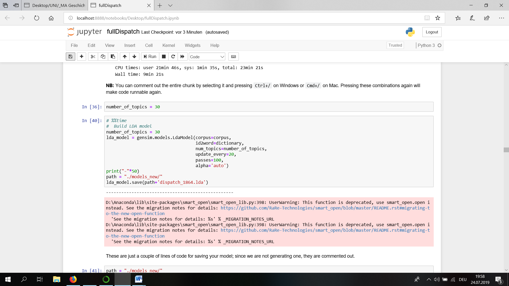
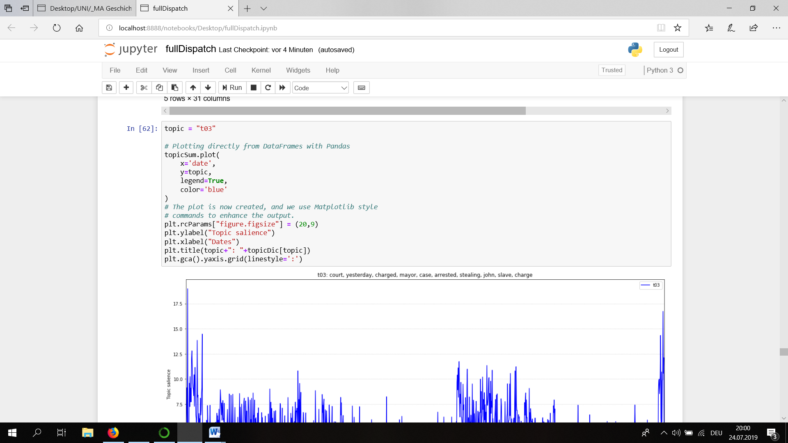
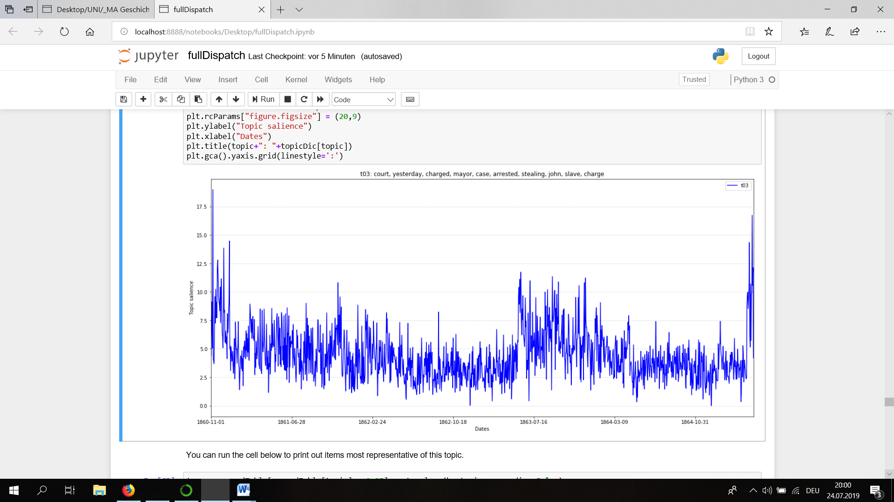
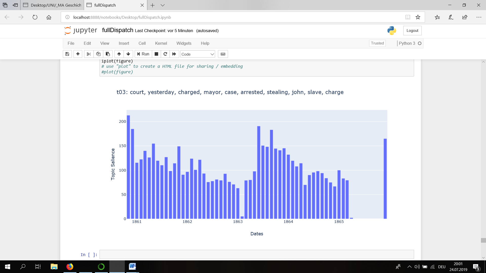
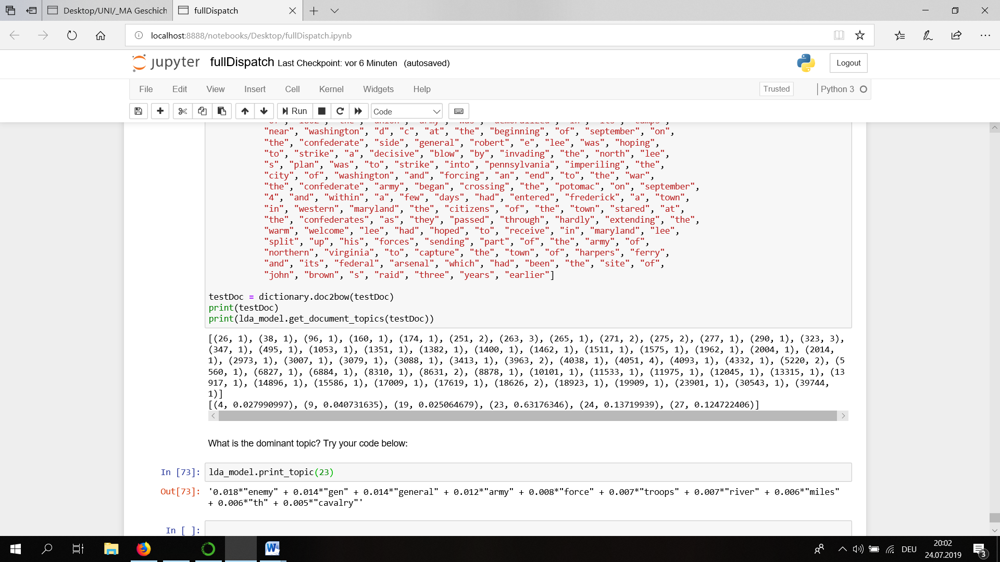
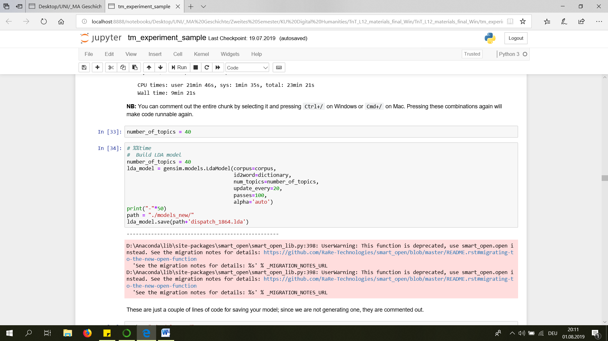
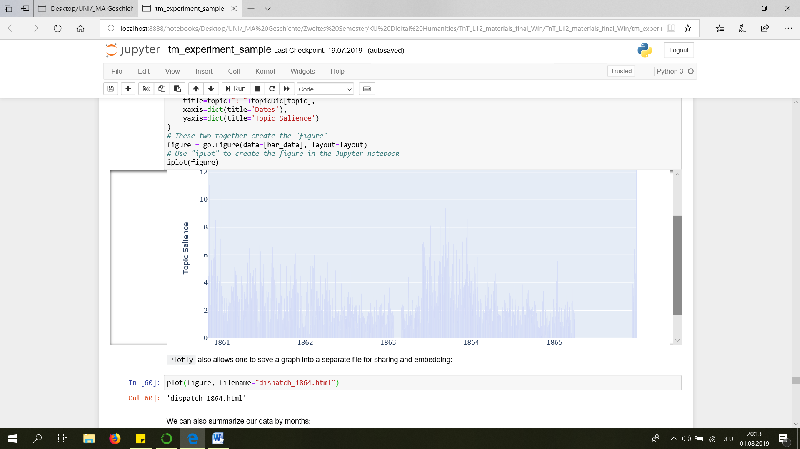
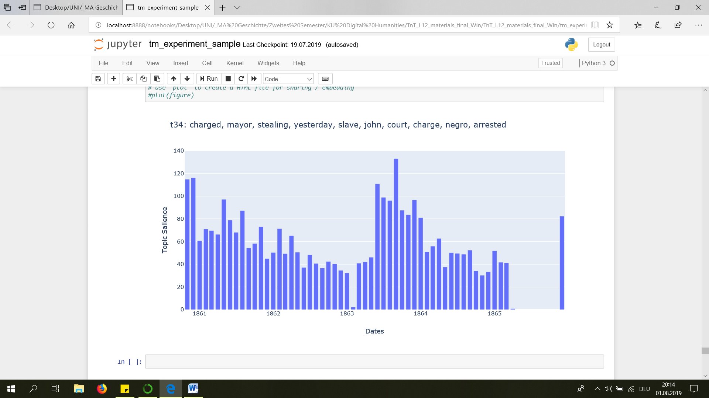
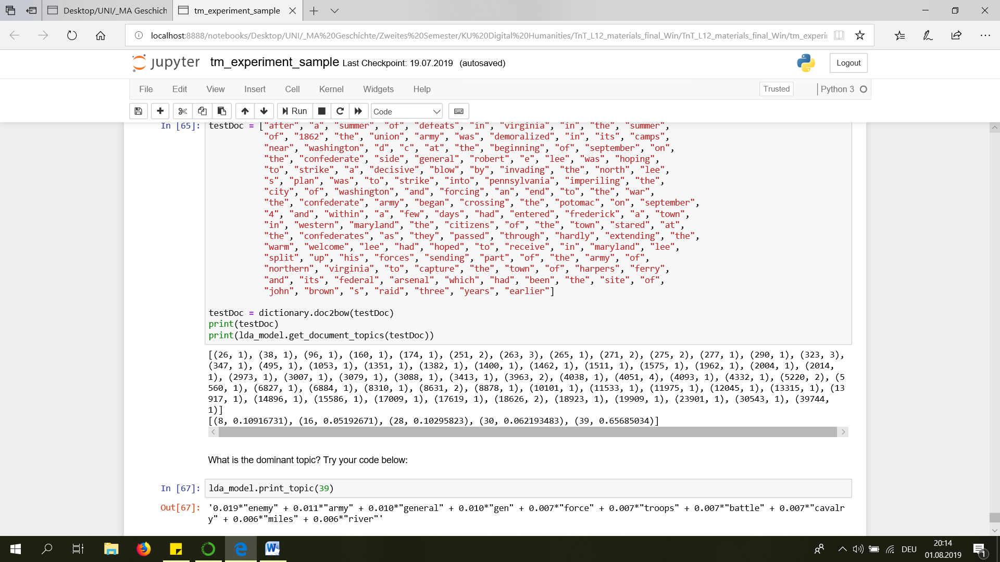

# Topic Modeling

First, I only ran the model on the year 1864. Then I ran it on the full "Dispatch", which is why You can find two versions of comparison in this Homework-Blogpost.

## Running the model on the full "Dispatch"

### Model with 30 topics:

First I ran the model with 30 topics.



The 30 topics are:

```
't00': 'amp, goods, street, ladies, stock, shoes, prices, call, st, clothing',
't01': 'mr, virginia, committee, convention, governor, house, vote, election, ' 'resolution, resolutions', 
't02': 'amp, medicines, store, brushes, hand, druggist, drug, drugs, kinds, ' 'th', 
't03': 'court, yesterday, charged, mayor, case, arrested, stealing, john, ' 'slave, charge', 
't04': 'fire, night, water, city, mr, feet, building, yesterday, street, iron', 
't05': 'regiment, wounded, th, col, killed, company, capt, lieut, gen, ' 'brigade', 
't06': 'richmond, office, dispatch, city, express, daily, notice, business, ' 'company, amp', 
't07': 'railroad, train, richmond, virginia, road, river, central, ' 'petersburg, lynchburg, depot', 
't08': 'mr, house, went, shot, saw, night, told, got, body, taken', 
't09': 'maryland, general, school, virginia, institute, book, published, amp, ' 'military, books', 
't10': 'god, life, country, soldiers, heart, home, noble, brave, children, ' 'love', 
't11': 'district, court, th, office, confederate, states, bank, association, ' 'virginia, insurance', 
't12': 'states, government, union, state, united, president, war, mr, peace, ' 'south', 
't13': 'sale, th, amp, house, hire, street, wanted, streets, corner, auction', 
't14': 'bill, mr, house, committee, senate, general, confederate, military, ' 'officers, service', 
't15': 'fort, york, city, prisoners, washington, steamer, officers, island, ' 'flag, federal', 
't16': 'reward, feet, dollars, negro, inches, richmond, black, th, delivery, ' 'county', 
't17': 'york, river, texas, amp, baltimore, steamer, boston, oclock, th, ' 'matters', 
't18': 'england, british, london, french, american, france, th, english, ' 'government, europe', 
't19': 'th, county, john, co, wm, miss, mrs, va, james, dr', 
't20': 'government, state, hundred, money, city, country, thousand, cotton, ' 'dollars, army', 
't21': 'treasury, bonds, notes, states, confederate, cent, secretary, ' 'certificates, department, interest', 
't22': 'amp, sale, co, tobacco, oil, bbls, boxes, sugar, coffee, street', 
't23': 'enemy, gen, general, army, force, troops, river, miles, th, cavalry', 
't24': 'war, south, southern, army, yankee, north, country, world, northern, ' 'yankees', 
't25': 'th, oclock, residence, died, friends, attend, funeral, inst, family, ' 'aged', 
't26': 'cents, bank, sales, market, corn, flour, stock, wheat, prices, price', 
't27': 'carolina, south, north, state, church, georgia, rev, city, virginia, ' 'tennessee', 
't28': 'hospital, street, th, medical, st, week, sick, surgeon, dr, patients', 
't29': 'company, service, order, th, richmond, companies, officers, virginia, ' 'va, office'
```

Then I visualized topic 3:




per months:



It shows in which periodes arrestations of slaves have in- or decreased. 


Reusing the model on “testDoc” gave me topic 23 as the dominant one:




### Model with 40 topics:



The 40 topics are:

```
't00': 'fort, steamer, vessels, island, navy, vessel, board, fleet, ship, ' 'charleston', 
't01': 'gen, general, tennessee, th, army, kentucky, mississippi, orleans, ' 'federal, troops', 
't02': 'service, general, officers, company, war, companies, orders, command, ' 'virginia, duty', 
't03': 'night, ladies, hall, mr, evening, young, theatre, flag, prince, music', 
't04': 'church, dispatch, rev, richmond, page, morning, daily, dr, city, news', 
't05': 'war, country, government, south, southern, power, states, north, ' 'army, public', 
't06': 'government, states, england, united, british, american, war, france, ' 'french, mr', 
't07': 'wanted, hire, house, amp, office, cook, ja, street, servant, th', 
't08': 'mr, washington, york, union, president, lincoln, party, general, ' 'peace, state', 
't09': 'bank, notes, cent, banks, tax, bonds, interest, treasury, money, ' 'exchange', 
't10': 'york, market, gold, cotton, firm, th, dull, bales, liverpool, ' 'baltimore', 
't11': 'mr, house, night, went, taken, morning, room, mrs, told, young', 
't12': 'sale, county, land, auction, estate, richmond, farm, court, slaves, ' 'sell', 
't13': 'amp, th, sale, oil, co, st, street, week, medical, furniture', 
't14': 'th, regiment, capt, company, col, lieut, wounded, co, killed, st', 
't15': 'treasury, bonds, states, confederate, secretary, department, ' 'certificates, notes, america, richmond', 
't16': 'mr, convention, vote, majority, virginia, elected, election, ' 'gentleman, question, conference', 
't17': 'court, case, judge, law, mr, corpus, yesterday, habeas, writ, ' 'confederate', 
't18': 'railroad, richmond, river, train, norfolk, petersburg, amp, central, ' 'road, danville', 
't19': 'goods, amp, ladies, street, shoes, stock, call, prices, clothing, ' 'boots', 
't20': 'military, work, army, general, war, southern, virginia, published, ' 'paper, life', 
't21': 'reward, feet, dollars, inches, negro, black, richmond, th, delivery, ' 'county', 
't22': 'company, th, order, oclock, st, richmond, members, capt, hall, ' 'evening', 
't23': 'fire, shot, fired, oclock, night, guns, morning, yesterday, battery, ' 'city', 
't24': 'th, street, streets, corner, amp, house, sale, lot, feet, rent', 
't25': 'mrs, miss, john, wm, mr, james, jas, dr, jno, smith', 
't26': 'cents, sale, sales, amp, bbls, flour, sugar, bushel, corn, cts', 
't27': 'county, amp, co, va, richmond, dr, john, messrs, king, office', 
't28': 'states, state, carolina, south, virginia, north, united, government, ' 'union, constitution', 
't29': 'cotton, hundred, thousand, dollars, trade, millions, government, ' 'supply, country, prices', 
't30': 'life, heart, god, home, am, hand, death, around, poor, brave', 
't31': 'court, trial, judge, jury, guilty, term, grand, tried, sentenced, ' 'penitentiary', 
't32': 'express, richmond, company, southern, amp, gas, orders, public, ' 'packages, office', 
't33': 'governor, district, th, commonwealth, confederate, states, virginia, ' 'county, state, proclamation', 
't34': 'charged, mayor, stealing, yesterday, slave, john, court, charge, ' 'negro, arrested', 
't35': 'city, soldiers, richmond, citizens, hospital, council, sick, army, ' 'ladies, families', 
't36': 'mr, bill, committee, house, senate, resolution, motion, referred, ' 'military, offered', 
't37': 'th, oclock, residence, friends, died, funeral, family, attend, aged, ' 'death', 
't38': 'prisoners, yankee, yesterday, city, prison, arrested, captured, ' 'provost, yankees, confederate', 
't39': 'enemy, army, general, gen, force, troops, battle, cavalry, miles, ' 'river'
```

Then I visualized topic 34:




I visualized a topic most similar to t03 from the 30-topic-version. In general, the visualization is similar to the visualization of the 30-topic-version, neverthelesse there are small differences to be seen and the 40-topics-version might be showing more oscillations starting from 1864.

Reusing the model on „testDoc“ gave me Topic 39 as the dominant one:



### Comparing 30 and 40 topics:

There are a lot of topics that have a “th” in it. This might be due to the mentioning of dates (“5th January …”) in the articles. The 30-topics-version has nine topics with “th” in it, while the 40-topics-version has ten. Another letter-combination often to be found is „amp“. It occurs seven times in the 30-topic-version and eight times in the 40-topic-version.
It seems there are more topics hardly usable for an analysis in the 40-topics-version than in the 30-topics-version. For the 30-topics-version I found the the following hardly usable:

```
't17': 'york, river, texas, amp, baltimore, steamer, boston, oclock, th, ' 'matters', 
't18': 'england, british, london, french, american, france, th, english, ' 'government, europe', 
't19': 'th, county, john, co, wm, miss, mrs, va, james, dr', 
't27': 'carolina, south, north, state, church, georgia, rev, city, virginia, ' 'tennessee', 
```

For the 40-topics-version the following:

```
't04': 'church, dispatch, rev, richmond, page, morning, daily, dr, city, news', 
't25': 'mrs, miss, john, wm, mr, james, jas, dr, jno, smith', 
```

(Of course, deeming a topic “hardly usable for analysis” also depends on your research-goals and your knowledge of context, etc.)
It seems that the 40 topics version has a higher rate of useful topics.

I also compared the words of four topics that were similar in both versions. t03(30topics) and t34(40topics) concern arrestations of slaves and have nine words in common. t05(30topics) and t14(40topics) concern the wounding/killing of soldiers and have eight words in common. t16(30topics) and t21(40topics) concern the sought of slaves by the police and have all words in common. t25(30topics) and t37(40topics) concern funerals and have nine words in common. So, it seems that creating a topics model with 30 as well was with 40 topics can create accurate topics. The words that are differing in the two different versions don’t change the topic content. Still, both versions also create topics that are hardly usable. 

### Comparison with Rob Nelson's *Mining the Dispatch*:

Topics t03(30) and t34(40) are similar to Rob Nelson’s topic “Court Proceedings”. As Nelson’s topic includes more and also different words, his statistical visualisation looks different, but it also shows spikes in 1863, which is the same for our t03 and t34. 

Even though Nelson’s *Mining the Dispatch* includes several military topics, I couldn’t find an exact equivalent for our topics t05(30) and t14(40) that seems to concern the killing/wounding of soldiers. This also shows that some of the topics we created in the 30- and 40-topic-version are very general topics that concern something as war or wounding/killing of soldiers in general. I think that it is hard to draw conclusions from topics like this, as they are too unspecific because of the words they include. It also seems topics in a topic model maybe should include more than ten words (as it is the case in Rob Nelson’s model). 

So I think the number of words in our topic matters. As we have 10 words per topic, Nelson has 24, which can change the accuracy, the numbers of articles you “get” with your model and especially the topic as a whole. This last point seems particularly important as it shows that comparison between different topic models/research using topic modelling is difficult as different parameters (e.g. number of words in a topic) can do a lot of change.

Our topics t16(30) and t21(40) are similar to Nelson’s topic “Fugitive Slave ads”. Looking at the words included in our topics and in Nelson’s I got the impression that we actually can’t know whether it is ads or other articles as reports, which is why I find the way Nelson named this topic problematic.

Our topics t25(30) and t37(40) are similar to Nelson’s topics “Death Notices”. 

Also, Nelson’s topics don’t include letter-combinations as “th” or “amp” which might be due to a different list of stop words. 


## Running the model on one year (1864)

### Model with 30 topics:

First I ran the model with 30 topics.


The 30 topics are

```
't00': 'governor, county, court, city, commonwealth, richmond, virginia, ' 'state, th, council', 
't01': 'mrs, miss, dr, john, wm, rev, mr, city, smith, james', 
't02': 'richmond, hundred, danville, railroad, dollars, thousand, virginia, ' 'black, county, reward', 
't03': 'yesterday, castle, thunder, city, co, committed, yankee, arrested, ' 'deserters, guard', 
't04': 'reward, dollars, feet, negro, th, inches, county, richmond, black, ' 'delivery', 
't05': 'bonds, charleston, savannah, treasurer, currency, security, ' 'generally, effect, cent, treasury', 
't06': 'war, country, government, army, states, yankee, south, power, state, ' 'north', 
't07': 'officers, service, officer, general, persons, enrolling, orders, th, ' 'duty, state', 
't08': 'notes, treasury, richmond, dispatch, bonds, cents, authorized, price, ' 'states, sold', 
't09': 'hotel, exchange, grand, ladies, evening, music, hall, street, ' 'richmond, american', 
't10': 'th, sale, co, st, oclock, street, company, auction, capt, order', 
't11': 'york, rebel, th, rebels, general, washington, city, gold, state, ' 'union', 
't12': 'cotton, paper, black, bales, dozen, papers, association, goods, ' 'pairs, book', 
't13': 'night, mr, fort, house, shot, hundred, captain, fired, water, oclock', 
't14': 'craddock, hand, face, seen, room, saw, big, went, mr, dress', 
't15': 'mr, bill, committee, house, senate, resolution, confederate, ' 'military, congress, states', 
't16': 'death, life, young, children, church, lady, god, woman, heart, women', 
't17': 'mobile, river, mississippi, th, gen, department, navy, steamer, ' 'vicksburg, oclock', 
't18': 'prices, pounds, pound, price, horses, bushel, rations, value, ' 'furnished, corn', 
't19': 'company, southern, express, soldiers, army, richmond, virginia, ' 'associations, friends, quartermaster', 
't20': 'mr, states, war, government, lincoln, united, president, union, ' 'peace, convention', 
't21': 'city, state, citizens, mr, hunter, homes, children, salt, sugar, cane', 
't22': 'hire, wanted, cook, house, servant, priv, woman, office, washer, ja', 
't23': 'st, states, january, confederate, th, profits, taxes, additional, ' 'public, government', 
't24': 'enemy, general, army, gen, cavalry, force, miles, troops, yesterday, ' 'line', 
't25': 'treasury, bonds, states, notes, cent, confederate, certificates, ' 'secretary, department, coupon', 
't26': 'fire, mr, house, building, destroyed, street, oclock, property, ' 'houses, city', 
't27': 'court, charged, stealing, yesterday, slave, case, mayor, john, mr, ' 'morning', 
't28': 'th, oclock, residence, friends, funeral, attend, aged, family, ' 'invited, died', 
't29': 'th, prisoners, major, gen, regiment, virginia, col, wounded, general, ' 'colonel'
```

Then I visualized topic 6:


Reusing the model on "testDoc" gave me topic 24 as the dominant one:


### Model with 40 topics:


The 40 topics are:

```
't00': 'virginia, richmond, carolina, north, th, city, company, confederate, ' 'office, order', 
't01': 'general, th, york, rebel, rebels, washington, union, state, states, ' 'hundred', 
't02': 'maryland, colonel, major, general, camp, regiment, johnson, virginia, ' 'company, officer', 
't03': 'treasury, notes, bonds, certificates, states, treasurer, secretary, ' 'interest, payment, confederate', 
't04': 'bonds, exchange, coupon, confederate, states, registered, treasury, ' 'cent, june, department', 
't05': 'army, gen, general, atlanta, tennessee, sherman, river, georgia, ' 'enemy, hood', 
't06': 'jpriv, wpriv, apriv, hpriv, hwinder, cwinder, iwinder, ewinder, ' 'gwinder, awinder', 
't07': 'st, january, profits, states, additional, confederate, buying, ' 'government, selling, taxes', 
't08': 'hire, wanted, house, cook, office, street, servant, woman, sale, ja', 
't09': 'life, death, young, city, home, woman, hall, night, church, heart', 
't10': 'war, country, government, state, army, states, south, peace, power, ' 'public', 
't11': 'southern, express, company, northern, soldiers, virginia, ' 'association, richmond, office, press', 
't12': 'court, judge, case, yesterday, confederate, trial, till, habeas, ' 'corpus, jury', 
't13': 'navy, slaves, confederate, department, service, states, property, ' 'sec, owner, war', 
't14': 'dispatch, cents, military, war, charge, richmond, states, ' 'confederate, copy, authorized', 
't15': 'mr, sugar, ford, enemy, theatre, craddock, george, states, banking, ' 'firm', 
't16': 'mr, young, lady, house, went, mrs, ladies, going, city, room', 
't17': 'miss, mrs, john, dr, wm, rev, james, mr, va, capt', 
't18': 'army, grant, yankee, richmond, general, lee, battle, campaign, ' 'yankees, thousand', 
't19': 'fort, vessels, vessel, ship, charleston, captain, steamer, fleet, ' 'iron, water', 
't20': 'officers, general, orders, forces, reserve, command, headquarters, ' 'duty, companies, order', 
't21': 'enemy, wounded, gen, cavalry, general, yesterday, killed, line, ' 'miles, prisoners', 
't22': 'castle, thunder, priv, yesterday, committed, arrested, deserters, ' 'attempting, charge, city', 
't23': 'mr, bill, committee, house, senate, resolution, confederate, ' 'congress, military, referred', 
't24': 'certificates, government, treasury, officers, secretary, states, ' 'required, authorized, supplies, payable', 
't25': 'governor, county, commonwealth, virginia, smith, richmond, court, ' 'counties, william, law', 
't26': 'hundred, dollars, market, thousand, prices, gold, money, currency, ' 'cotton, price', 
't27': 'th, oclock, residence, friends, funeral, attend, died, aged, family, ' 'church', 
't28': 'pounds, horses, bushel, pound, council, rations, horse, furnished, ' 'corn, lbs', 
't29': 'reward, boy, navy, th, va, hair, subscriber, dollars, john, pass', 
't30': 'railroad, train, danville, cars, central, depot, road, car, accident, ' 'general', 
't31': 'confederate, board, states, medical, surgeon, duty, officers, ' 'retired, service, worship', 
't32': 'charged, stealing, slave, court, mayor, negro, yesterday, arrested, ' 'house, stolen', 
't33': 'reward, dollars, feet, richmond, inches, county, black, negro, th, ' 'hundred', 
't34': 'mr, states, government, war, united, england, lincoln, peace, london, ' 'american', 
't35': 'prisoners, yankee, city, officers, prison, yankees, flag, ' 'confederate, captured, truce', 
't36': 'sale, auction, th, co, sell, street, oclock, sold, lot, furniture', 
't37': 'fire, mr, night, street, house, oclock, building, morning, robbed, ' 'room', 
't38': 'th, co, company, st, capt, va, richmond, city, regiment, cavalry', 
't39': 'persons, officer, enrolling, service, bureau, th, exemption, general, ' 'officers, commandants'
```

Here I also did a visualization for one of the topics:


It suggests that articles concerning arrestations of slaves have decreased since January 1864.

In the model with 40 topics the dominant topic in "testDoc" was 18:


### Comparing 30 and 40 topics:

There are a lot of topics tat have a "th" in it. This might be due to the mentioning of dates 
("5th January ...") in the articles. The 30-topics-version has 8 topics 
with "th" in it, while the 40-topics-version only has 7, even though there are more topics in it. 
It also seems that there are more topics hardly usable for an analysis in the 40-topics-version 
than in the 30-topics-version. For the 30-topics-version I found the the following topic hardly 
usable:

`t01: mrs, miss, dr, john, wm, rev, mr, city, smith, james`

For the 40-topics-version I found the following topics hardly usable:

```
t06: jpriv, wpriv, apriv, hpriv, hwinder, cwinder, iwinder, ewinder, gwinder, awinder
t17: miss, mrs, john, dr, wm, rev, james, mr, va, capt
t25: governor, county, comonwealth, virginia, smith, richmond, court, counties, william, law
t29: reward, boy, navy, th, va, hair, subscriber, dollars, john, pass
t38: th, co, company, st, capt, va, richmond, city, regiment, cavalry
```

(Of course, deeming a topic "hardly usable for analysis" also depends on your research-goals 
and your knowledge of context, etc.) 

I also compared the words in some of the topics that where similar in the 30- and 40-topics-version. 
For example t06 in the 30- and t10 in the 40-topics-version have a lot of words in common and concern 
war. Comparing the topics you can see, that both concern war in such a general way, that it might 
be hard to draw any conclusions based on the occurence of those topics. The words they have in 
common are: war, country, government, army, states, south, power, state. While the 
30-topics-version also has "yankee" and "south", the 40-topics-version has "peace" and "public". 
From that I got the impression that the character of a topic is not made out of all of the words it 
included, but only out of half of them. 
t22 in the 30-topics-version and t08 in the 40-topics-version would be another example for this. They 
have the following words in common: hire, wanted, house, cook, office, servant, woman, ja. While in 
the 30-topics-version it also has "priv" and "washer", in the 40-topics-version it has "street" 
and "sale". As in the example above, the topic-content (hiring a servant) doesn't seem to change 
because of the two words that are different. 


### Comparison with Rob Nelson's *Mining the Dispatch*:

Rob Nelson's topic "For Hire and Wanted Ads" is similar to the above mentioned 
t22 and t08. What I found interesting is, that even though the topic has to do 
with the hiring of slaves, neither my topics t22 and t08, nor Nelsons topic include 
the term "slave" or the racist term "negro". This might also be interesting as it may 
be the case that when analyzing with the words in those topics it might be hard to 
differentiate hiring ads for people working as servants, maids, etc. and hiring ads for 
slaves - which actually makes a difference. 

I also compared t32 with Nelson's graphs. t32 suggests that since January, articles 
concerning arrestations of slaves have decreased. The topic in Nelson's analysis that 
ressembles t32 the most is his topic "Court Proceedings", which actually shows an increase 
starting in January 1864.  

Moreover, I found it difficult to compare our 30- or 40-topic-version with Nelson's topics as I found it 
hard to even  decide what some of our topics actually are about. E.g. t35: prisoners, yankee, city, 
officers, prison, yankees, flag, confederate, captured, truce. I would struggle to give t35 an overall 
name, which is why I found it hard to compare our topics to Rob Nelson's as matching our topics with 
Nelson's is difficult (e.g. because we used a model where the topics include 10 words and Nelson has 
topics including 24). 


