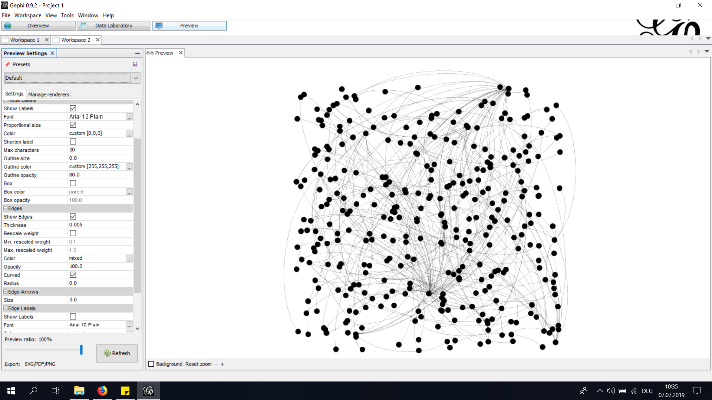
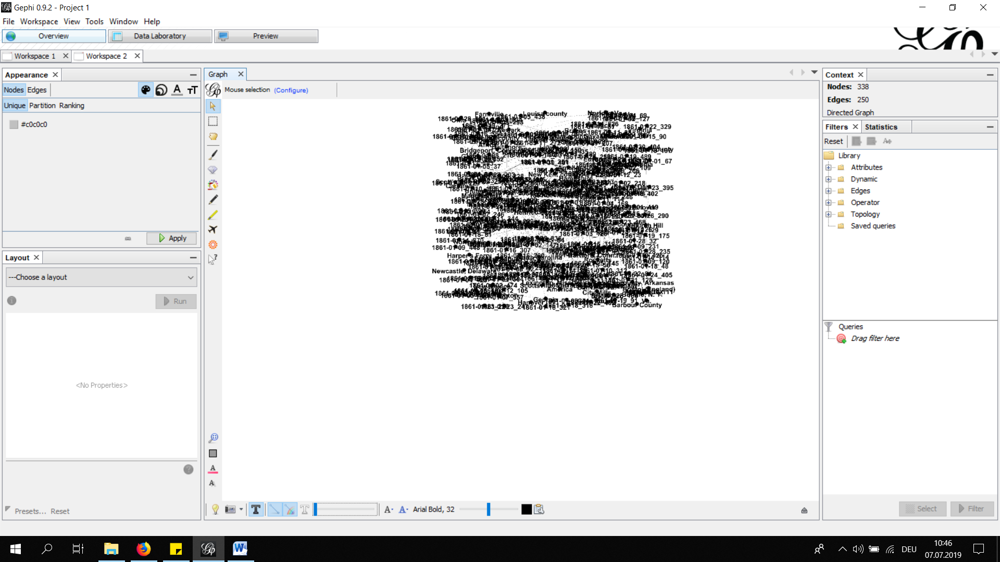
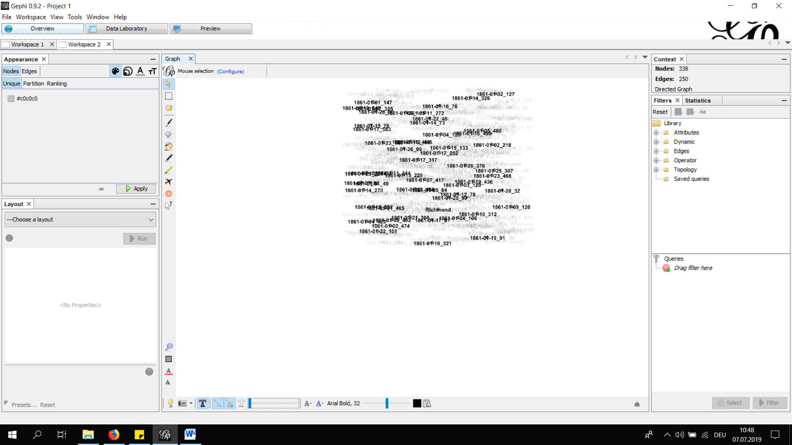
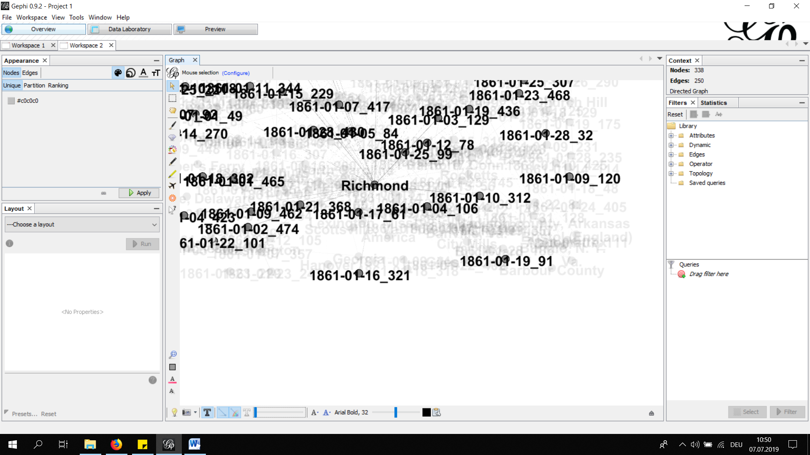
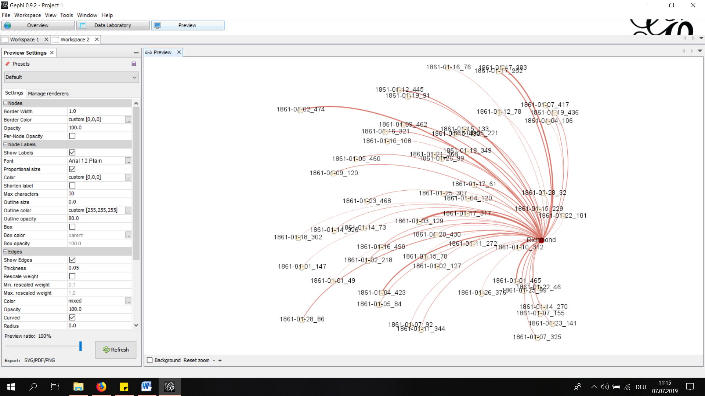
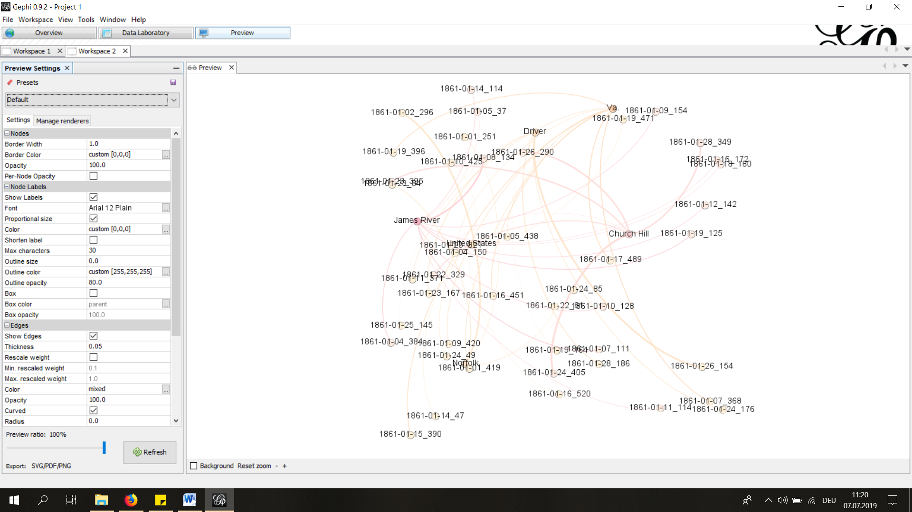
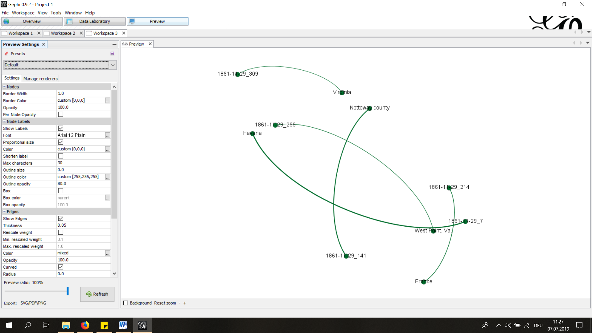

# Social Network Analysis on the "Dispatch"

To fulfill the tasked I used the instructions provided by Daniel Stoxreiter and Gabriele Hackl and sort of mixed them together.

## Code with comments:

```
import re, os, csv #importing regular expressions, the OS Module and csv
from bs4 import BeautifulSoup #importing BeautifulSoup

folder_out = "C:\\Users\\Tobias\\Desktop\\UNI\\_MA Geschichte\\Zweites Semester\\KU Digital Humanities\\wgetfolder\\Articles3\\" #defining a variable for the path to the xml-files of the articles
folder_in = "C:\\Users\\Tobias\\Desktop\\UNI\\_MA Geschichte\\Zweites Semester\\KU Digital Humanities\\_Aufgaben\\" #defining a variable for the path to where I want to save the new file

list_of_files = os.listdir(folder_out)  #defining a variable for the path to the xml-files

print("Salut") #printing a string

def generate(filter): #defining a function "generate"; filter will in this case be "year-month" (1861-01) -> goes through all xmls, looks for for the digits("year-month")
    Dic = {}   #defining an empty Dictionary for the data we are going to generate
    for f in list_of_files: #looping through the xml-files
        if f.startswith("dltext"): #checking the file-name
            soup = BeautifulSoup (open(folder_out+f, "r", encoding="utf8"), features="html.parser")     #opening the files
            date = soup.find_all("date", limit=2) [1]   #finding all dates using BeautifulSoup and storing the dates in a variable "date"; by using "limit=2" & [1], we make sure that only the second match is appended to the variable
            date = date.get("value")    #getting the value of the dates and storing them in "date"

            all_articles = soup.find_all("div3", type = True)   #using BeautifulSoup to find all the articles by finding all "<div3>"-tags
                
            if date.startswith(filter):#checking if the date we are using our function "generate" on corresponds with the filter
                    counter = 0     #setting a counter
                    for article, item in enumerate(all_articles): #looping through all the articles 
                        counter += 1    #updating the counter 
                        print(counter)  #printing the counter
                        # creating an ID:
                        ID = date+"_"+str(counter)  #creating a variable for the ID that consists of the date & the counter as a string
                        placenames = item.find_all("placename", key = True) #finding all the placenames using BeautifulSoup
                        for place, item in enumerate(placenames):   #looping through the placenames
                            place = item.get_text() #using BeautifulSoup to get the name of each place by using "item.get_text()" on "placeName reg="Carlow, Daviess, Missouri" key="tgn,2058264" authname="tgn,2058264">Carlow</placeName>"; storing each name of a place in a variable "place"
                            print(place)    #printing the places
                            key = ID + str(place)   #defining a key, consisting of the variables "ID" and "place"(as a string) to calculate the weight 
                            
                        if key in Dic:     #opening an if-function -> if "key" already exists in the dictionary, the weight augments +1
                            Dic[key]['weight']+= 1
                        else:               #if not the weight stays the same
                            Dic[key] = {
                                'source': ID,   #here we also define "source", "target", and "weight" for the tsv file: source=ID, target=place, weight=a number
                                'target': place,
                                'weight': 1
                            }            

    
    tsv_columns =  ['source', 'target','weight']    #defining the columns for our tsv 
    with open(folder_in+"TSV_HW13_day.tsv", "w", newline='', encoding="utf8") as f9:    #saving the new file as TSV
            writer = csv.DictWriter(f9, delimiter ='\t',fieldnames=tsv_columns) 
            writer.writeheader()        
            for data in Dic:  #using an if-clause to only store nodes that "weigh" more than 10 in the Dictionary in order to redce data
                if Dic[data]['weight'] >= 10: 
                    writer.writerow(Dic[data]) 
 

generate("1861-11-29") #using our function "generate" on January, 1861
print(generate) #printing the function
print("Hey there!") #printing another string 

```

## Visualization:

As other students suggested to be careful with analyzing the full „Dispatch“, as it gives you such a lot of data, I decided to only use the code on one month: January 1861.

Here you can see an overview without node-labels:



This happens when adding node labels:



It is hard to work with thatbecause there is such a lot of data. Putting the cursor over a node helps a little bit to analyze:



For example: in the following screenshot we can see that Richmond is mentioned in a lot of articles.




Then I used „Modularity“ and played around with that filter:
Here you can see again how often Richmond is mentioned.



It is also possible to tick off the item with the highest rate (Richmond), in order to analyse items with lower rates:



Using and trying out those tools, I got the impression that it is really hard to visualize such a high amount of data that we 
get from the „Dispatch“, even if we are only analyzing one month. I also tried visualizing just one day from the „Dispatch“ 
in gephi (29/11/1861), but that doesn’t really make sense as shown in the following screenshot:



