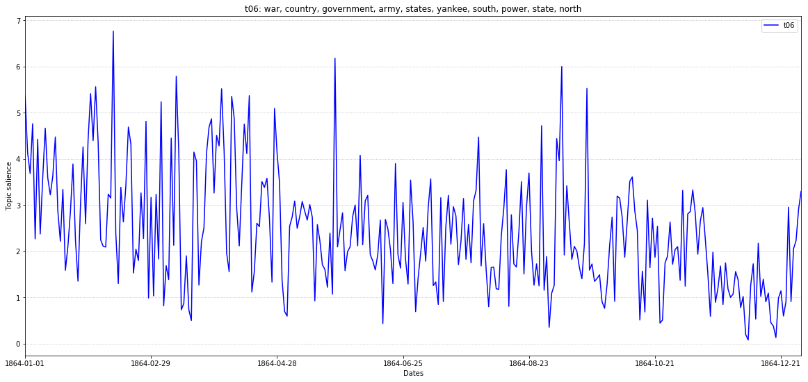
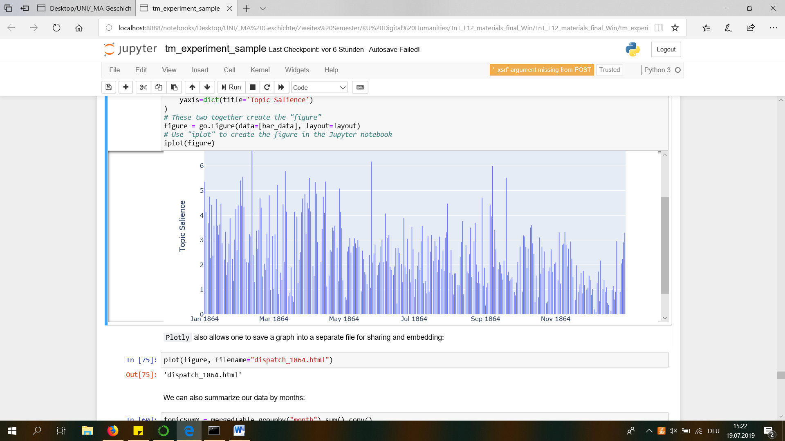

# Topic Modeling

As my notebook was very slow on the whole "Dispatch" - one of the very first steps took a whole night - I decided to
only run it on the year 1864.

## Model with 30 topics:

First I ran the model with 30 topics.


The 30 topics are

```
't00': 'governor, county, court, city, commonwealth, richmond, virginia, ' 'state, th, council', 
't01': 'mrs, miss, dr, john, wm, rev, mr, city, smith, james', 
't02': 'richmond, hundred, danville, railroad, dollars, thousand, virginia, ' 'black, county, reward', 
't03': 'yesterday, castle, thunder, city, co, committed, yankee, arrested, ' 'deserters, guard', 
't04': 'reward, dollars, feet, negro, th, inches, county, richmond, black, ' 'delivery', 
't05': 'bonds, charleston, savannah, treasurer, currency, security, ' 'generally, effect, cent, treasury', 
't06': 'war, country, government, army, states, yankee, south, power, state, ' 'north', 
't07': 'officers, service, officer, general, persons, enrolling, orders, th, ' 'duty, state', 
't08': 'notes, treasury, richmond, dispatch, bonds, cents, authorized, price, ' 'states, sold', 
't09': 'hotel, exchange, grand, ladies, evening, music, hall, street, ' 'richmond, american', 
't10': 'th, sale, co, st, oclock, street, company, auction, capt, order', 
't11': 'york, rebel, th, rebels, general, washington, city, gold, state, ' 'union', 
't12': 'cotton, paper, black, bales, dozen, papers, association, goods, ' 'pairs, book', 
't13': 'night, mr, fort, house, shot, hundred, captain, fired, water, oclock', 
't14': 'craddock, hand, face, seen, room, saw, big, went, mr, dress', 
't15': 'mr, bill, committee, house, senate, resolution, confederate, ' 'military, congress, states', 
't16': 'death, life, young, children, church, lady, god, woman, heart, women', 
't17': 'mobile, river, mississippi, th, gen, department, navy, steamer, ' 'vicksburg, oclock', 
't18': 'prices, pounds, pound, price, horses, bushel, rations, value, ' 'furnished, corn', 
't19': 'company, southern, express, soldiers, army, richmond, virginia, ' 'associations, friends, quartermaster', 
't20': 'mr, states, war, government, lincoln, united, president, union, ' 'peace, convention', 
't21': 'city, state, citizens, mr, hunter, homes, children, salt, sugar, cane', 
't22': 'hire, wanted, cook, house, servant, priv, woman, office, washer, ja', 
't23': 'st, states, january, confederate, th, profits, taxes, additional, ' 'public, government', 
't24': 'enemy, general, army, gen, cavalry, force, miles, troops, yesterday, ' 'line', 
't25': 'treasury, bonds, states, notes, cent, confederate, certificates, ' 'secretary, department, coupon', 
't26': 'fire, mr, house, building, destroyed, street, oclock, property, ' 'houses, city', 
't27': 'court, charged, stealing, yesterday, slave, case, mayor, john, mr, ' 'morning', 
't28': 'th, oclock, residence, friends, funeral, attend, aged, family, ' 'invited, died', 
't29': 'th, prisoners, major, gen, regiment, virginia, col, wounded, general, ' 'colonel'
```

Then I visualized topic 6:





Reusing the model on "testDoc" gave me topic 24 as the dominant one:


## Model with 40 topics:


The 40 topics are:

```
't00': 'virginia, richmond, carolina, north, th, city, company, confederate, ' 'office, order', 
't01': 'general, th, york, rebel, rebels, washington, union, state, states, ' 'hundred', 
't02': 'maryland, colonel, major, general, camp, regiment, johnson, virginia, ' 'company, officer', 
't03': 'treasury, notes, bonds, certificates, states, treasurer, secretary, ' 'interest, payment, confederate', 
't04': 'bonds, exchange, coupon, confederate, states, registered, treasury, ' 'cent, june, department', 
't05': 'army, gen, general, atlanta, tennessee, sherman, river, georgia, ' 'enemy, hood', 
't06': 'jpriv, wpriv, apriv, hpriv, hwinder, cwinder, iwinder, ewinder, ' 'gwinder, awinder', 
't07': 'st, january, profits, states, additional, confederate, buying, ' 'government, selling, taxes', 
't08': 'hire, wanted, house, cook, office, street, servant, woman, sale, ja', 
't09': 'life, death, young, city, home, woman, hall, night, church, heart', 
't10': 'war, country, government, state, army, states, south, peace, power, ' 'public', 
't11': 'southern, express, company, northern, soldiers, virginia, ' 'association, richmond, office, press', 
't12': 'court, judge, case, yesterday, confederate, trial, till, habeas, ' 'corpus, jury', 
't13': 'navy, slaves, confederate, department, service, states, property, ' 'sec, owner, war', 
't14': 'dispatch, cents, military, war, charge, richmond, states, ' 'confederate, copy, authorized', 
't15': 'mr, sugar, ford, enemy, theatre, craddock, george, states, banking, ' 'firm', 
't16': 'mr, young, lady, house, went, mrs, ladies, going, city, room', 
't17': 'miss, mrs, john, dr, wm, rev, james, mr, va, capt', 
't18': 'army, grant, yankee, richmond, general, lee, battle, campaign, ' 'yankees, thousand', 
't19': 'fort, vessels, vessel, ship, charleston, captain, steamer, fleet, ' 'iron, water', 
't20': 'officers, general, orders, forces, reserve, command, headquarters, ' 'duty, companies, order', 
't21': 'enemy, wounded, gen, cavalry, general, yesterday, killed, line, ' 'miles, prisoners', 
't22': 'castle, thunder, priv, yesterday, committed, arrested, deserters, ' 'attempting, charge, city', 
't23': 'mr, bill, committee, house, senate, resolution, confederate, ' 'congress, military, referred', 
't24': 'certificates, government, treasury, officers, secretary, states, ' 'required, authorized, supplies, payable', 
't25': 'governor, county, commonwealth, virginia, smith, richmond, court, ' 'counties, william, law', 
't26': 'hundred, dollars, market, thousand, prices, gold, money, currency, ' 'cotton, price', 
't27': 'th, oclock, residence, friends, funeral, attend, died, aged, family, ' 'church', 
't28': 'pounds, horses, bushel, pound, council, rations, horse, furnished, ' 'corn, lbs', 
't29': 'reward, boy, navy, th, va, hair, subscriber, dollars, john, pass', 
't30': 'railroad, train, danville, cars, central, depot, road, car, accident, ' 'general', 
't31': 'confederate, board, states, medical, surgeon, duty, officers, ' 'retired, service, worship', 
't32': 'charged, stealing, slave, court, mayor, negro, yesterday, arrested, ' 'house, stolen', 
't33': 'reward, dollars, feet, richmond, inches, county, black, negro, th, ' 'hundred', 
't34': 'mr, states, government, war, united, england, lincoln, peace, london, ' 'american', 
't35': 'prisoners, yankee, city, officers, prison, yankees, flag, ' 'confederate, captured, truce', 
't36': 'sale, auction, th, co, sell, street, oclock, sold, lot, furniture', 
't37': 'fire, mr, night, street, house, oclock, building, morning, robbed, ' 'room', 
't38': 'th, co, company, st, capt, va, richmond, city, regiment, cavalry', 
't39': 'persons, officer, enrolling, service, bureau, th, exemption, general, ' 'officers, commandants'
```

Here I also did a visualization for one of the topics:


It suggests that articles concerning arrestations of slaves have decreased since January 1864.

In the model with 40 topics the dominant topic in "testDoc" was 18:


## Comparing 30 and 40 topics:

There are a lot of topics tat have a "th" in it. This might be due to the mentioning of dates 
("5th January ...") in the articles. The 30-topics-version has 8 topics 
with "th" in it, while the 40-topics-version only has 7, even though there are more topics in it. 
It also seems that there are more topics hardly usable for an analysis in the 40-topics-version 
than in the 30-topics-version. For the 30-topics-version I found the the following topic hardly 
usable:

`t01: mrs, miss, dr, john, wm, rev, mr, city, smith, james`

For the 40-topics-version I found the following topics hardly usable:

```
t06: jpriv, wpriv, apriv, hpriv, hwinder, cwinder, iwinder, ewinder, gwinder, awinder
t17: miss, mrs, john, dr, wm, rev, james, mr, va, capt
t25: governor, county, comonwealth, virginia, smith, richmond, court, counties, william, law
t29: reward, boy, navy, th, va, hair, subscriber, dollars, john, pass
t38: th, co, company, st, capt, va, richmond, city, regiment, cavalry
```

(Of course, deeming a topic "hardly usable for analysis" also depends on your research-goals 
and your knowledge of context, etc.) 

I also compared the words in some of the topics that where similar in the 30- and 40-topics-version. 
For example t06 in the 30- and t10 in the 40-topics-version have a lot of words in common and concern 
war. Comparing the topics you can see, that both concern war in such a general way, that it might 
be hard to draw any conclusions based on the occurence of those topics. The words they have in 
common are: war, country, government, army, states, south, power, state. While the 
30-topics-version also has "yankee" and "south", the 40-topics-version has "peace" and "public". 
From that I got the impression that the character of a topic is not made out of all of the words it 
included, but only out of half of them. 
t22 in the 30-topics-version and t08 in the 40-topics-version would be another example for this. They 
have the following words in common: hire, wanted, house, cook, office, servant, woman, ja. While in 
the 30-topics-version it also has "priv" and "washer", in the 40-topics-version it has "street" 
and "sale". As in the example above, the topic-content (hiring a servant) doesn't seem to change 
because of the two words that are different. 


## Comparison with Robe Nelson's *Mining the Dispatch*:

Rob Nelson's topic "For Hire and Wanted Ads" is similar to the above mentioned 
t22 and t08. What I found interesting is, that even though the topic has to do 
with the hiring of slaves, neither my topics t22 and t08, nor Nelsons topic include 
the term "slave" or the racist term "negro". This might also be interesting as it may 
be the case that when analyzing with the words in those topics it might be hard to 
differentiate hiring ads for people working as servants, maids, etc. and hiring ads for 
slaves - which actually makes a difference. 

I also compared t32 with Nelson's graphs. t32 suggests that since January, articles 
concerning arrestations of slaves have decreased. The topic in Nelson's analysis that 
ressembles t32 the most is his topic "Court Proceedings", which actually shows an increase 
starting in January 1864. What we might be able to conclude here is that analysing the "Dispatch" 
with a search for certain words might not be enough to draw conclusions. Looking at the words in 
Nelson's topic "Court Proceedings" I got the impression that it doesn't differantiate who committed 
which crime, which is also true for our t32. So from my point of view it is difficult to work with 
the graphs/statistics that we get from topic modelling the dispatch as to me the created topics 
seem to lack "accuracy". 

Comparing our Topic-Model and Nelson's also gave me the impression that the number of words in 
our topic matters. As we have 10 words per topic, Nelson has 24, which can change the accuracy, 
the numbers of articles you "get" with your model and especially the topic as a whole. This last 
point seems particularly important as it shows that comparison between different topic models/research using topic modelling is 
difficult as different parameters (e.g. number of words in a topic) can do a lot of change. 

Moreover, I found it difficult to compare our 30- or 40-topic-version with Nelson's topics as I found it 
hard to even  decide what some of our topics actually are about. E.g. t35: prisoners, yankee, city, 
officers, prison, yankees, flag, confederate, captured, truce. I would struggle to give t35 an overall 
name, which is why I found it hard to compare our topics to Rob Nelson's as matching our topics with 
Nelson's is difficult (e.g. because we used a model where the topics include 10 words and Nelson has 
topics including 24). 


